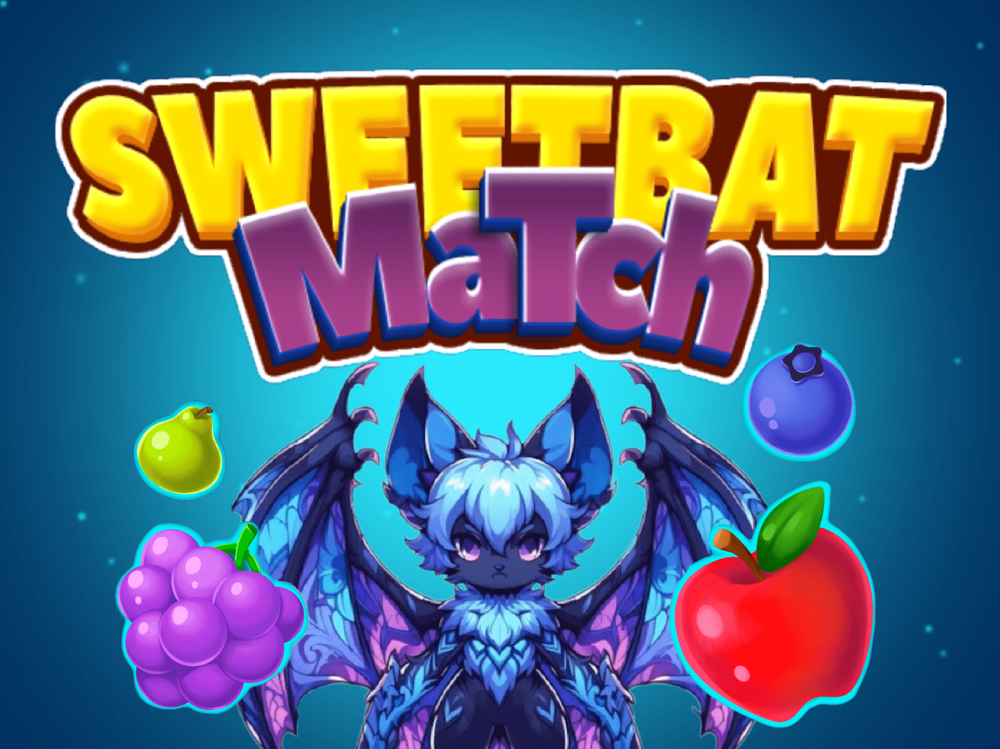

# SweetBat Match

Welcome to SweetBat Match, an exciting Match 3 puzzle adventure! Combine delicious fruits to create extraordinary combinations and advance through procedurally generated levels that offer unique challenges in each match.

## Contents:

-   [Demo](#demo)
-   [Features](#features)
-   [Connectivity Features](#connectivity-features)
-   [The process](#the-process)
-   [Privacy Policy](#privacy-policy)
-   [Contact](#contact)
-   [License](#license)
-   [Author](#author)

## Demo

</img>
</img>
</img>

[Watch Video](https://youtu.be/F-DekC9kqmg)

## Features
- Addictive Match 3 game with captivating graphics.
- Life system that recharges every 30 minutes.
- Four challenging game modes: Target Score, Feeding Target, Time Target and Collect Fruit.
- Virtual coins to buy power-ups.
- Power-ups and unlockable fruits as you progress through the game.
- Procedural level system for a unique gaming experience.

## Connectivity Features
- Login system with Google and Facebook using Firebase.
- Saved in the cloud with Cloud Firestore so you never lose your progress.

## The process
### **Built with**

Technologies used in the project:

-   Unity
-   C#
-   Firebase

## Privacy Policy
You can find our full privacy policy [here](https://martandrey.github.io/SweetBat-Match-Privacy-Policy). We value your privacy and are committed to protecting your personal data.

## Contact
If you have any questions, concerns or requests related to the game or the privacy policy, please feel free to contact us at the email address [martandreydev@gmail.com](mailto:martandreydev@gmail.com) .

I'm excited to present to you my first commercial game developed in Unity with C#. I hope you enjoy SweetBat Match and I look forward to your comments and suggestions! SweetBat Match offers a free gaming experience with minimal ads designed to reward you with bonuses. Embark on this addictive, fruit-filled adventure that will leave you wanting more!

Enjoy the game and the experience we offer!

## License:
> This project is licensed under the MIT License

## Author
Made by [MartAndrey](https://www.linkedin.com/in/MartAndrey)
